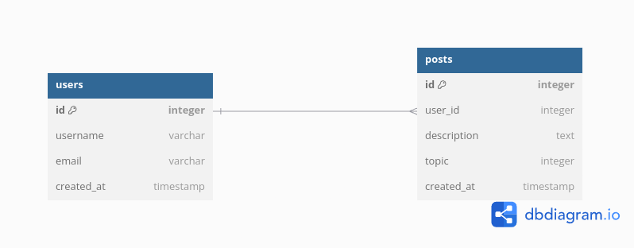

# CMPLN

CMPLN steht für das englische Wort **complain**, ohne die Selbstlaute (ja ich weiss sehr kreativ). 
Die Anwendung kann Beschwerden von allen Nutzern hier anzeigen. Eine bestimmte Authentifizierung ist nicht gegeben. Es werden nur Nicknames auf Email-Adressen aufgelöst, um eventuelle Beiträge zurück zu verfolgen. Der Post muss dann per Email bestätigt werden.  

## Test Driven Development
Alle Komponenten der Anwendung werden Testbegleitend implementiert. Ein Workflow wird diese später ausführen und nur bei 100% Erfolg der Testfälle diesen Deployen (Sei es in einem Docker Container auf irgendeiner cloud (oder auch nicht weil es kostet Geld) oder auf einem Server per FTP oder SFTP, oder auf meiner IP per Portforwarding per FTP oder SFTP (sehr ungerne)). 

## Client Side
Das Frontend wird in HTMX mit der Nutzung von TEMPL zur Komponentisierung (dieses Wort existiert eventuell nicht) gerendered. HTMX holt sich per GET-Request die Komponenten aus dem Server, und rendered diese durch Adressierung eines Objekts in der DOM per **hx-target** oder **hx-swap** (je nach Use-Case).
(siehe [HTMX Docs](https://htmx.org/docs/#targets))

## Datenbank
MariaDB. Keine Ahnung warum unbedingt. Ist halt eine Relationale Datenbank die gut funktioniert und kostenlos ist (zumindest lokal). Werde wahrscheinlich aber auf PostgreSQL wechseln.
